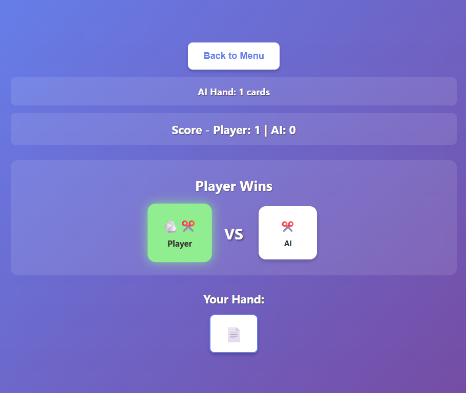

# Rock Paper Scissors Card Game - React


[](https://www.npmjs.com/package/@theomegafett/rps-game-logic)
[](https://github.com/TheOmegaFett/RPS-Card-Game/actions/workflows/ci.yml)


**Author:** Shane Miller (TheOmegaFett)

🔗 **Quick Links:** [Appendix](APPENDIX.md) | [Contributing](CONTRIBUTING.md) | [Deployment](DEPLOYMENT.md) | [Testing](TESTING.md) | [Changelog](CHANGELOG.md)

---

A turn-based card game featuring Rock, Paper, Scissors mechanics with special card types, deck building, and strategic gameplay.



## Installation

```bash
cd card-game-react
npm install
npm start
```

Open [http://localhost:3000](http://localhost:3000) in your browser

## 🧩 Node.js Theme Expansion

This project extends beyond a single app — the core logic has been published as a standalone **NPM package**:  
[`@theomegafett/rps-game-logic`](https://www.npmjs.com/package/@theomegafett/rps-game-logic)

```bash
npm install @theomegafett/rps-game-logic
```

**Why?** Demonstrates modular Node.js development, code reusability, and package publishing best practices.

## Features

- 🎴 Build custom 20-card decks with rarity limits
- 🎮 Strategic gameplay with special card effects
- 🤖 **Three AI difficulty modes** - Easy, Normal, and Hard with probabilistic card counting
- ⚙️ **Comprehensive Settings Panel** - Control theme, sound, motion, contrast, and difficulty
- 🎵 **Sound Effects** - Countdown, flip, and win/loss sounds with volume control
- 🌓 **Dark Mode & High Contrast** - Multiple accessibility themes with localStorage
- 🎴 **Animated Card Flip with Countdown** - Dramatic 3, 2, 1, GO! countdown before reveal
- 📚 **Draw Pile Displays** - Visual card stacks showing remaining deck counts
- 📥 Import/Export deck configurations (.txt files)
- 📱 Responsive design for mobile and desktop
- ♿ **Perfect Accessibility** - 100/100 Lighthouse score, WCAG 2.1 AA compliant ([audit](docs/lighthouse-accessibility.pdf))
- 📖 In-game instructions and card reference
- 📦 **Modular NPM Package** - Core game logic extracted as reusable package

## How to Play

1. **Choose Difficulty**: Select Easy, Normal, or Hard mode
2. **Toggle Theme**: Switch between light and dark mode
3. **Start a Game**: Choose from default deck, build custom deck, or import a deck
4. **Gameplay**: Each player starts with 3 cards. Select a card to play
5. **Card Reveal**: Watch the countdown (3, 2, 1, GO!) as cards flip over
6. **Win Condition**: The player with the most turn victories wins when someone runs out of cards
7. **Card Rules**: Rock beats Scissors, Scissors beats Paper, Paper beats Rock

## Card Types

### Common Cards (max 4 each)
- **🪨 Rock**: Defeats Scissors
- **📄 Paper**: Defeats Rock
- **✂️ Scissors**: Defeats Paper

### Uncommon Cards (max 2 each)
- **🪨 ➕1 Rock +Draw**: Defeats Scissors, draw 1 card after playing
- **📄 ➕1 Paper +Draw**: Defeats Rock, draw 1 card after playing
- **✂️ ➕1 Scissors +Draw**: Defeats Paper, draw 1 card after playing

### Rare Cards (max 1-2 each)
- **📄🪨 Paper-Rock Hybrid**: Acts as both Paper AND Rock
- **🪨✂️ Rock-Scissors Hybrid**: Acts as both Rock AND Scissors
- **✂️📄 Scissors-Paper Hybrid**: Acts as both Scissors AND Paper
- **🔒🚫 Block & Discard**: Blocks scoring, opponent discards 1 random card

### Legendary Cards (max 1)
- **🔒➕2 Block & Draw 2**: Blocks scoring, you draw 2 cards

## Deck Building Rules

- **Deck Size**: Minimum 10 cards, maximum 20 cards
- **Rarity Limits**: Each card type has a maximum allowed per deck
- **Strategy**: Balance offense (winning types), defense (blocks), and card advantage (draw effects)

## Importing/Exporting Decks

### Export Format
Decks are saved as `.txt` files with the format:
```
ROCK 4
PAPER 3
SCISSORS 3
ROCK_DRAW 2
PAPER_DRAW 2
SCISSORS_DRAW 2
BLOCK_DRAW_TWO 1
BLOCK_DISCARD 1
PAPER_ROCK 1
ROCK_SCISSORS 1
```

### Import
Click "Import Deck" from the main menu and select a `.txt` file following the format above.

## Development

### Project Structure
```
packages/
└── rps-game-logic/   # NPM package - Core game logic
    ├── src/
    │   ├── Card.js           # Card class and CardType enum
    │   ├── Deck.js           # Deck management
    │   ├── Player.js         # Player class
    │   ├── GameController.js # Game state and logic
    │   ├── constants.js      # Game constants
    │   └── index.js          # Package exports
    ├── package.json
    └── README.md

src/
├── components/        # React components (UI)
├── controllers/       # Legacy controllers (uses package)
├── constants/        # UI constants (emojis, limits)
├── styles/           # CSS stylesheets
│   ├── App.css       # Main application styles
│   └── index.css     # Global styles and resets
├── App.jsx           # Main app component
└── index.js          # Entry point
```

### Code Quality
- ✅ Full JSDoc documentation
- ✅ PropTypes validation on all components
- ✅ Memory leak prevention (proper cleanup)
- ✅ Performance optimizations (memoization)
- ✅ Accessibility compliant (WCAG 2.1)
- ✅ **Automated testing with Jest + React Testing Library**
- ✅ **CI/CD pipeline with GitHub Actions**

See [STYLE_GUIDE.md](STYLE_GUIDE.md) for complete coding standards and developer guidelines.

### NPM Package - @theomegafett/rps-game-logic

The core game logic has been extracted into a standalone NPM package for code reusability:

🔗 **[View on NPM](https://www.npmjs.com/package/@theomegafett/rps-game-logic)**

- **Package Name**: `@theomegafett/rps-game-logic`
- **Version**: 1.1.0 (app v1.1.1)
- **Package Location**: `packages/rps-game-logic/`
- **Installation**: `npm install @theomegafett/rps-game-logic`
- **Usage**: `import { Card, Deck, GameController } from '@theomegafett/rps-game-logic';`
- **Documentation**: See [packages/rps-game-logic/README.md](packages/rps-game-logic/README.md)

**Benefits:**
- ✅ **Published on NPM** - Available to the entire developer community
- ✅ Pure JavaScript, no React dependencies
- ✅ Reusable in Node.js backend, CLI tools, or other frontends
- ✅ Well-documented with JSDoc
- ✅ Demonstrates modular architecture

This showcases modern Node.js development practices and code reusability patterns.

## Browser Support

- Chrome (latest)
- Firefox (latest)
- Safari (latest)
- Edge (latest)

## Deployment & Production

### Building for Production
```bash
npm run build
```
This creates an optimized production build in the `build/` folder with:
- Minified and bundled JavaScript
- Cache-busting filenames
- Optimized CSS

### Server Configuration (Recommended)

For optimal performance and security, configure your web server with:

#### Headers
```nginx
# Content-Type with UTF-8
add_header Content-Type "text/html; charset=utf-8";

# Security headers
add_header X-Content-Type-Options "nosniff" always;
add_header X-Frame-Options "DENY" always;
add_header X-XSS-Protection "1; mode=block" always;

# Content Security Policy (production)
add_header Content-Security-Policy "default-src 'self'; script-src 'self'; style-src 'self' 'unsafe-inline';" always;
```

#### Caching
```nginx
# Static assets (with hash in filename)
location ~* \.(js|css|png|jpg|jpeg|gif|ico|svg|woff|woff2)$ {
    add_header Cache-Control "public, max-age=31536000, immutable";
}

# HTML files
location ~* \.html$ {
    add_header Cache-Control "public, max-age=0, must-revalidate";
}
```

### Deployment Platforms

#### Render
1. Go to [Render Dashboard](https://dashboard.render.com/)
2. Click "New +" → "Static Site"
3. Connect your GitHub repository
4. Configure:
   - **Build Command**: `npm install && npm run build`
   - **Publish Directory**: `build`
5. Deploy!

#### GitHub Pages
```bash
npm run build
# Deploy the build folder
```

#### Netlify/Vercel
- Auto-deploys from Git
- Headers configured via `netlify.toml` or Vercel settings
- Automatic HTTPS and cache optimization

**Note:** The warnings about CSP `eval` and missing headers only apply to development mode (`npm start`). The `render.yaml` configuration file ensures production builds on Render have all required headers.

## AI & Tooling Disclosure

### Use of AI-Assisted Development

This project was developed with the assistance of AI-based coding tools, including **Amp** (by Sourcegraph) and **ChatGPT**, used for code completion, debugging, refactoring, and documentation generation. All AI-generated code was reviewed, tested, validated, and integrated manually by the author.

### Purpose & Rationale

The use of AI in this project was chosen specifically for:

- **Rapid Development**: Accelerating the migration from Python to React within limited time availability
- **Learning & Growth**: Exploring the evolving world of agentic-assisted development and modern development workflows
- **Quality Focus**: Addressing bugs, performance optimization, and usability improvements efficiently
- **Best Tool for the Job**: Using the most effective tools available to complete the task to a high standard

I am an advocate for using the best tools available to achieve quality results. AI assistance was used as a **development accelerator and learning aid**, not as a replacement for understanding, decision-making, or craftsmanship.

### Analogy

I treat AI assistance as a **tool**, much like a graphics tablet for an artist or a calculator for an engineer — it enhances capability and efficiency, but the vision, judgment, and responsibility remain entirely with the creator.

### Ethical Commitment

This project upholds full transparency and strict adherence to Australian ethics standards and laws. The use of AI is disclosed openly:

- ✅ All AI-assisted code has been reviewed and validated by the author
- ✅ Significant AI-generated contributions are marked with "Co-authored-by" in commit messages
- ✅ The project is original work, with AI used as a tool, not as a substitute for authorship
- ✅ Compliant with academic integrity principles and professional development standards

**No deception, no misrepresentation — just transparent, ethical use of modern development tools.**

## 📚 Documentation

- **[Appendix](APPENDIX.md)** - Academic context, learning outcomes, and project reflection
- **[Dev Log](DEVLOG.md)** - Development roadmap, future features, and ongoing reflections
- **[Contributing Guide](CONTRIBUTING.md)** - How to contribute to this project
- **[Code of Conduct](CODE_OF_CONDUCT.md)** - Community guidelines
- **[Testing Guide](TESTING.md)** - Manual testing procedures and planned automated tests
- **[Deployment Guide](DEPLOYMENT.md)** - Deploy to Render, Netlify, Vercel, or GitHub Pages
- **[Changelog](CHANGELOG.md)** - Version history and release notes
- **[Style Guide](STYLE_GUIDE.md)** - Coding standards and best practices

## License

This project is licensed under the MIT License - see the LICENSE file for details.
